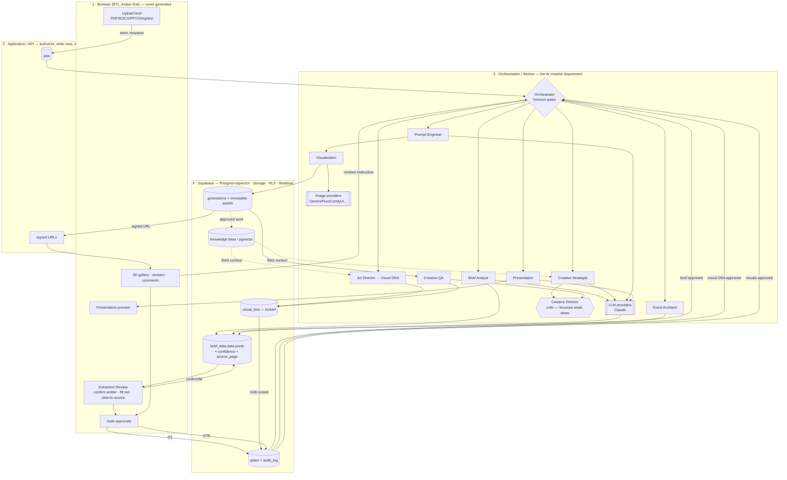

# ARCHITECTURE.md — Azure Media Group Creative Event Design Platform

> Status: **proposal, for approval.** No production code is written until this is
> signed off. After approval we build module by module, in the phase order at the
> end of this document.
>
> This document reconciles two briefs that describe the same product at two zoom
> levels:
>
> - **`SPEC.md`** — the *Tender Dossier System*: turn a government/municipal tender
>   into a compliant written proposal (extraction → scoring → blocks → PDF).
> - **The Creative Event Design brief** — the *AI Creative Event Design Department*:
>   turn a brief into a creative concept, visual system, 3D concepts, and a
>   presentation.
>
> They are not two systems. They are **one platform, one project record, two
> production tracks that share a common brief-intelligence core.**

---

## 0. The one decision everything else hangs on

Read this first. Every later section assumes it.

```
                         ┌───────────────────────────────┐
                         │      SHARED CORE (Phase 1)     │
                         │  Ingest → Brief Intelligence   │
                         │  structured JSON + confidence  │
                         │  + source traceability + gates │
                         └───────────────┬───────────────┘
                                         │
                 ┌───────────────────────┴───────────────────────┐
                 │                                                 │
     ┌───────────▼────────────┐                     ┌─────────────▼───────────┐
     │  TRACK A — PROPOSAL     │                     │  TRACK B — CREATIVE     │
     │  (SPEC.md)              │                     │  (this brief)           │
     │  scoring → outline →    │                     │  strategy → moodboard → │
     │  blocks → dossier PDF   │                     │  Visual DNA → spaces →  │
     │                         │                     │  3D → revisions →       │
     │  wins the bid on paper  │                     │  presentation           │
     └─────────────────────────┘                     └─────────────────────────┘
```

Both tracks:
- start from the **same uploaded brief** and the **same structured extraction**,
- carry **confidence + source-page traceability** on every extracted fact,
- pass through the **same human gate engine**,
- write to the **same job queue, asset store, role model, and audit log**,
- end in a **generated, versioned deliverable** (a dossier, or a presentation).

A government tender usually needs **both**: Track A to be compliant, Track B to be
chosen. A private client pitch may need only Track B. So we build the shared core
once and let a project turn either track on.

**Naming decision (flagged for your confirmation):** `SPEC.md` uses `tenders` as
the top entity. The broader product is not always a tender. This document proposes
generalising it to **`projects`** with a `project_type` (`tender` | `pitch` |
`hybrid`); "tender" becomes a project type, not the root concept. Everything in
`SPEC.md` maps forward unchanged. **This is the one schema decision I'd want you to
confirm before we write the first migration**, because it is expensive to unwind
later (CLAUDE.md working style: "a wrong assumption buried in a schema is expensive
to unwind").

---

## Table of contents (maps to your 20 requested deliverables)

| # | Deliverable | Section |
|---|---|---|
| 1 | Product architecture | §1 |
| 2 | Complete user journey | §2 |
| 3 | System workflow | §3 |
| 4 | AI agent architecture | §4 |
| 5 | Application modules | §5 |
| 6 | Database architecture | §6 |
| 7 | Project data structure | §7 |
| 8 | Image-generation workflow | §8 |
| 9 | Revision workflow | §9 |
| 10 | Approval workflow | §10 |
| 11 | Presentation-generation workflow | §11 |
| 12 | Recommended technology stack | §12 |
| 13 | Recommended AI models/services per task | §13 |
| 14 | Folder / code architecture | §14 |
| 15 | API architecture | §15 |
| 16 | Security considerations | §16 |
| 17 | Version-control strategy for creative assets | §17 |
| 18 | MVP scope | §18 |
| 19 | Phase 2 roadmap | §19 |
| 20 | Phase 3 roadmap | §20 |
| — | Information-flow diagram | §21 |

---

## 1. Product architecture

A four-layer system. The rule from CLAUDE.md is absolute and shapes every layer:
**the browser never generates. It uploads, displays, edits, and reviews.** All
extraction, reasoning, image generation, and rendering run as server-side
background jobs. API keys live only in server secrets.

```
┌──────────────────────────────────────────────────────────────────────┐
│  1. CLIENT — Next.js App Router (RTL, Arabic-first)                     │
│     Dashboard · Project workspace (tabs) · Extraction review ·         │
│     Moodboard · Visual DNA · Spaces · 3D gallery · Revision · Approve  │
│     Presentation preview. Talks only to the API. Holds no secrets.     │
└───────────────────────────────┬──────────────────────────────────────┘
                                 │  route handlers + server actions
┌───────────────────────────────▼──────────────────────────────────────┐
│  2. APPLICATION / API — Next.js server                                 │
│     AuthZ (RLS + role checks) · writes job rows · issues signed URLs · │
│     serves project state · gate transitions. Returns immediately;      │
│     never blocks on a model call.                                      │
└───────────────────────────────┬──────────────────────────────────────┘
                                 │  claims jobs
┌───────────────────────────────▼──────────────────────────────────────┐
│  3. ORCHESTRATION / WORKER — the AI Creative Department                 │
│     Job runner → Agent orchestrator → agents (Brief Analyst,           │
│     Strategist, Event Architect, Art Director, Prompt Engineer,        │
│     Visualization, Creative QA, Presentation, Feasibility, Creative    │
│     Director/critic). Agents share state through the project record.   │
│     Provider abstraction: LLM providers + Image providers.             │
└───────────────────────────────┬──────────────────────────────────────┘
                                 │
┌───────────────────────────────▼──────────────────────────────────────┐
│  4. DATA / INFRA — Supabase                                            │
│     Postgres (+ pgvector) · Auth · private Storage · RLS · Realtime.   │
│     Plus: external LLM APIs, external image-gen providers, Playwright  │
│     render service.                                                    │
└──────────────────────────────────────────────────────────────────────┘
```

Why this shape:

- **Jobs table + worker, not a queue service** (CLAUDE.md): a `jobs` row is written
  synchronously, the UI returns instantly and subscribes to status over Supabase
  Realtime. We do not reach for SQS/BullMQ until the simple version proves
  insufficient.
- **The worker is where "the AI creative department" lives.** Everything expensive,
  slow, or provider-specific is behind the job boundary, so the UI stays fast and
  the same job can be retried, versioned, and audited.
- **Provider abstraction at layer 3**, not scattered through the app — one seam for
  LLMs, one for image engines. Adding Flux or swapping a model is a config change,
  not a refactor.

---

## 2. Complete user journey

Roles in brackets. Gates are the only points where a human must act to proceed.

```
[Admin] invites a user by email → user sets password (no public sign-up)
        │
[PM] creates a Project → picks tracks (Proposal / Creative / both) → uploads
        brief (PDF / DOCX / PPTX / images / text / RFP / tender)
        │
        ▼  ── SHARED CORE ──────────────────────────────────────────────
[system] job: EXTRACT → Brief Intelligence Report
        every field: value + confidence (green/amber/red) + source page
        │
[PM/Lead] Extraction Review screen: confirm amber, fill red, resolve
        contradictions. Missing facts stay RED — never fabricated.
        │
        ╞══ GATE 1: "Brief understood" ══ [Creative Director / Approver]
        │
        ├───────────────► TRACK A (Proposal, if enabled)
        │        [system] outline proposed from scoring table (weight↔pages)
        │        [Lead]   adjust outline
        │        ╞══ GATE 2A: outline approved ══
        │        [system] jobs: generate each block
        │        [Lead]   review & edit inline
        │        ╞══ GATE 3A: dossier approved ══
        │        [system] export dossier PDF + versioned snapshot
        │
        └───────────────► TRACK B (Creative)
                 [agent] Creative Strategy (Big Idea, narrative, journey…)
                 ╞══ GATE 2B: strategy approved ══ [Creative Director]
                 [agent] Moodboard generation
                 ╞══ GATE 3B: moodboard approved ══
                 [agent] Visual DNA locked (canonical reference + params)
                 ╞══ GATE 4B: Visual DNA approved ══ (locks consistency)
                 [agent] Event Architect: which spaces, zoning, guest flow
                 [Art Dir] adjust space list
                 ╞══ GATE 5B: space plan approved ══
                 [agents] per space: Prompt Engineer → Visualization → 3D renders
                          Creative QA checks each against Visual DNA
                 [Creative Director] review gallery: approve / request revision
                 [loop]   Revision system: V01 → V02 → … → FINAL
                 ╞══ GATE 6B: visuals approved ══
                 [agent] Presentation Generator (only relevant sections)
                 [Creative Director] review deck
                 ╞══ GATE 7B: presentation approved ══
                 [system] export presentation (PDF/PPTX) + snapshot
        │
[Client Viewer] sees only explicitly shared artifacts — never internal drafts.
```

The journey is **the same creative methodology the brief insists on** (§21 of your
brief): never *Brief → AI Image*. The path is
`Brief → Understanding → Strategy → Concept → Narrative → Moodboard → Visual DNA →
Spatial Design → Visualization → Review → Revision → Presentation`, and the gate
engine physically prevents skipping steps — a space-render job cannot be enqueued
until Visual DNA is approved.

---

## 3. System workflow (state machine)

Project status is a single enum that spans both tracks; track-specific sub-state
lives on the track's own rows.

```
draft
  → extracting            (job running)
  → awaiting_data         (amber/red fields need humans)   ⟵ GATE 1 pending
  → brief_approved
  → in_strategy | in_outline
  → in_moodboard
  → in_visual_dna
  → in_spatial
  → in_visualization
  → in_review
  → in_revision
  → approved
  → presentation_ready
  → delivered
```

Every transition is:
1. a **job** (server does the work) **or** a **gate** (human approves), never both;
2. **auditable** (who, when, from→to) in an append-only `audit_log`;
3. **idempotent and retryable** — a failed job never corrupts state; it can be
   re-run without touching sibling artifacts (per-block, per-space, per-image).

**Job lifecycle** (shared by every generation type):

```
queued → running → (succeeded | failed → retry) 
                       │
                   writes artifact row(s) + emits next job or raises a gate
```

The worker claims jobs with `SELECT … FOR UPDATE SKIP LOCKED` so multiple worker
instances can run without a broker. Progress is written to the `jobs` row and
streamed to the UI via Supabase Realtime.

---

## 4. AI agent architecture

**Principle: agents collaborate through shared project state, not by talking to
each other in memory.** Each agent is a server-side job that reads the project
record, does one job well, and writes structured output back. The record *is* the
shared context. This makes every step inspectable, resumable, and gate-able.

```
                    ┌──────────────────────────────────┐
                    │        ORCHESTRATOR              │
                    │  reads project state, decides    │
                    │  which agent-job to enqueue next │
                    │  honours gates (won't skip ahead)│
                    └───────────────┬──────────────────┘
        reads/writes shared PROJECT CONTEXT (Postgres rows + jsonb)
   ┌───────────┬───────────┬───────────┬───────────┬───────────┬──────────┐
   ▼           ▼           ▼           ▼           ▼           ▼          ▼
Brief       Creative    Event       Art         Prompt      Visualiz.   Creative
Analyst     Strategist  Architect   Director    Engineer    Agent       QA
│           │           │           │           │           │           │
extract →   Big Idea,   zones,      Visual DNA, approved     runs image  checks
structured  narrative,  guest flow, moodboard,  concept →    providers,  each render
JSON +      journey,    zoning      material/   generation   metadata,   against
confidence  principles              colour/     prompt       versions    Visual DNA
                                    lighting

                    ┌──────────────────┐     ┌──────────────────────┐
                    │ Presentation      │     │ Production Feasibility│
                    │ Agent             │     │ Agent                 │
                    │ assembles deck    │     │ "can this be built?"  │
                    └──────────────────┘     └──────────────────────┘

           ┌──────────────────────────────────────────────────────┐
           │  AI CREATIVE DIRECTOR (critic / evaluator)            │
           │  Not a generator. Scores every proposed idea:        │
           │  relevant? original? strong? feasible? on-brand?     │
           │  UAE/government-appropriate? scalable? coherent?     │
           │  Weak idea → demands a stronger alternative before   │
           │  it reaches a human gate.                            │
           └──────────────────────────────────────────────────────┘
```

**Agent contract (uniform).** Every agent job receives `{ project_id, inputs,
visual_dna? }`, is given a **role-specific system prompt**, is constrained to return
**structured output validated against a schema** (so a malformed answer is retried,
not persisted), and records a **trace** (model, tokens, prompt hash, cost) in
`agent_runs` for audit and cost control.

**The Creative Director agent is a quality gate, not a step.** It runs *inside*
generation stages and can bounce a weak Strategy or a Visual-DNA-violating render
back for regeneration before a human ever sees it — implementing your brief's §18
requirement that the system "challenge weak ideas." It never *approves* on a human's
behalf; a human still signs every gate.

**Anti-fabrication rule threads through all agents** (CLAUDE.md): no agent may
invent a tender fact — a date, area, quantity, penalty, deadline. If it isn't in the
source, it's `red` and a human supplies it. Agents may make *creative* assumptions
(Track B) but every assumption is written to `assumptions[]` and surfaced in the UI.

---

## 5. Application modules

Each module = a bounded slice of UI + API + (optionally) agents. Built and shipped
independently.

| Module | Owns | Track |
|---|---|---|
| **Auth & Org** | invite-only accounts, roles, RLS policies | shared |
| **Projects & Dashboard** | project list, status, deadlines, team, progress | shared |
| **Ingestion** | upload (PDF/DOCX/PPTX/img/text), storage, file kind detection | shared |
| **Brief Intelligence** | extraction, structured report, confidence flags, source traceability, contradictions, missing-info, assumptions | shared |
| **Proposal (Track A)** | scoring→outline, block library, block generation, dossier PDF | A |
| **Company Library** | past projects, people/CVs, suppliers, certificates, blocks | A (feeds B) |
| **Creative Strategy** | Big Idea, narrative, journey, principles | B |
| **Moodboard** | visual reference generation + curation | B |
| **Visual DNA** | canonical design system object; consistency source of truth | B |
| **Spaces & Zoning** | space identification, floorplan thinking, guest flow | B |
| **Visualization** | prompt composition, image-provider orchestration, 3D gallery | B |
| **Revision** | image-to-image / prompt / reference revision, version history | B |
| **Review & Approval** | gates, comments, statuses, sign-off | shared |
| **Presentation** | deck assembly, Azure template system, export | B (A reuses render) |
| **Knowledge Base** | RAG over past projects, materials, venues, brand rules | shared |
| **Providers** | LLM + image-engine abstraction, config, keys | shared |
| **Jobs & Worker** | queue, retries, progress, scheduling | shared |
| **Admin & Audit** | users/roles, brand templates, audit log | shared |

---

## 6. Database architecture

Postgres on Supabase, RLS on **every** table, `pgvector` for the knowledge base.
The tables from `SPEC.md §5` are kept and extended; new creative-track tables are
added. `tenders` generalises to `projects` (see §0).

**Governing data-model rule (CLAUDE.md):** the extracted brief lives in a single
`jsonb` column. Brief structures vary enormously between clients — do **not** model
brief fields as columns; model them as JSON and render the UI from a field map.

### 6.1 Shared core

```sql
profiles        id, email, full_name, role, created_at
projects        id, project_type, title, client, contract_no, deadline,
                status, tracks jsonb, owner_id, created_at        -- was `tenders`
project_files   id, project_id, path, kind, mime, size, uploaded_by
brief_data      id, project_id, data jsonb, version, updated_by   -- was `tender_data`
field_flags     id, project_id, field_path, confidence,          -- green/amber/red
                source_page, status
assignments     id, project_id, field_path, assignee_id, done
jobs            id, project_id, type, status, progress, error,
                payload jsonb, attempts, started_at, finished_at
gates           id, project_id, gate_key, status, decided_by, decided_at, note
comments        id, project_id, target_type, target_id, body, author_id, created_at
audit_log       id, project_id, actor_id, action, from_state, to_state, meta jsonb, at
agent_runs      id, project_id, agent, model, prompt_hash, tokens_in,
                tokens_out, cost, status, trace jsonb, at
```

### 6.2 Track A — Proposal (from SPEC.md, retained)

```sql
blocks          id, code, name, description, template, is_active
project_blocks  id, project_id, block_id, sort_order, target_pages, status, output
company_projects  id, name, client, year, scope, images, certificate_path
company_people    id, name, title, cv_path, years_exp
company_suppliers id, name, category, rating, notes
company_certs     id, name, kind, path, valid_until
```

### 6.3 Track B — Creative

```sql
creative_strategy id, project_id, data jsonb, version, status
moodboards        id, project_id, version, status
moodboard_items   id, moodboard_id, category, image_asset_id, caption, source
visual_dna        id, project_id, version, status, data jsonb   -- THE consistency object
spaces            id, project_id, type, name_ar, name_en, sort_order,
                  requirements jsonb, status
generations       id, project_id, space_id, kind, version, status,
                  asset_id, provider, model, settings jsonb, prompt,
                  reference_asset_ids uuid[], parent_generation_id, qa jsonb
assets            id, project_id, storage_path, mime, checksum, width, height,
                  created_by_job, created_at              -- immutable, content-addressed
revisions         id, generation_id, mode, instruction, result_generation_id, by, at
presentations     id, project_id, version, status, structure jsonb
presentation_slides id, presentation_id, section, sort_order, content jsonb, asset_ids uuid[]
kb_documents      id, kind, project_ref, title, body, meta jsonb
kb_chunks         id, kb_document_id, content, embedding vector(1536)
```

Key relationships:
- `generations.parent_generation_id` chains **version history** (V01→V02→FINAL).
- `generations.reference_asset_ids` + `visual_dna` enforce the **consistency engine**
  (§8, §10 of your brief).
- `assets` are **immutable and content-addressed** (checksum in path) — a version is
  never overwritten; a revision creates a new asset and a new `generations` row.

---

## 7. Project data structure (the shared context object)

A project's canonical state is assembled from the rows above into one context object
that agents and the UI consume. Shape (abbreviated):

```jsonc
{
  "project": { "id", "type": "tender|pitch|hybrid", "client", "title",
               "deadline", "status", "tracks": ["proposal","creative"] },

  // SHARED — the Brief Intelligence Report (brief_data.data)
  "brief": {
    "event_information": { … }, "objectives": [ … ], "audience": { … },
    "venue": { … }, "experience_requirements": [ … ],
    "spatial_requirements": [ … ], "content_requirements": [ … ],
    "branding_requirements": [ … ], "technical_requirements": [ … ],
    "production_requirements": [ … ], "deliverables": [ … ],
    "constraints": [ … ],
    "missing_information": [ { "field", "why_needed" } ],   // → RED fields
    "contradictions": [ { "a", "b", "note" } ],
    "assumptions": [ { "statement", "basis", "confidence" } ],
    "ai_recommendations": [ … ],
    // every leaf also carries: confidence (green/amber/red) + source_page
  },

  // TRACK A (SPEC.md shape, unchanged): meta, scoring[], events[], sites[],
  //   gates[], permits[], penalties[], compliance[], inputs_required_from_azure[]
  //   — see samples/alain-g242026.json (the canonical fixture for every screen).

  // TRACK B
  "strategy": { "big_idea", "concept", "narrative", "guest_journey",
                "experience_philosophy", "design_principles", … },
  "visual_dna": {
    "master_concept", "primary_geometry", "secondary_geometry",
    "signature_shape", "material_palette", "color_palette",
    "lighting_language", "pattern_system", "architectural_keywords",
    "forbidden_styles", "brand_rules",
    "reference_assets": [assetId…], "approved_assets": [assetId…]
  },
  "spaces": [ { "id","type","requirements","zoning","views":[generationId…] } ],
  "presentation": { "sections": [ … ] }
}
```

Every extracted leaf keeps `confidence` + `source_page`, so the UI can render the
green/amber/red map and **click-to-source** (click a field → PDF viewer jumps to its
page). CLAUDE.md is explicit that this traceability is *the* feature that makes the
system trustworthy — it is not optional.

---

## 8. Image-generation workflow

The hard requirement is **consistency, not image quality** (SPEC.md §8; your brief
§10). Forty renders must look like one event, not forty projects. The Visual DNA
object is the mechanism.

```
Visual DNA (approved, LOCKED)  ──────────────┐
   master concept, geometry, materials,       │  canonical reference image(s)
   colours, lighting, forbidden styles,        │  + locked generation params (seed,
   reference assets                            │  style strength, negative prompt)
                                               ▼
Space spec ──►  PROMPT ENGINEER agent  ──►  composed prompt
(type, size,        merges space intent WITH Visual DNA;
 requirements)      cannot contradict forbidden_styles
                                               │
                                               ▼
                    VISUALIZATION agent ──►  Provider Abstraction Layer
                                               │  picks engine by config/capability
                    ┌──────────────────────────┼───────────────────────────┐
                    ▼            ▼               ▼             ▼             ▼
              Gemini/Nano     Flux         SDXL/ComfyUI   OpenAI img     (future)
                    └──────────────────────────┬───────────────────────────┘
                       image-to-image seeded from canonical reference
                                               ▼
                    asset stored (immutable) + generations row with FULL metadata:
                    project · space · version · prompt · references · model ·
                    settings · approval status
                                               ▼
                    CREATIVE QA agent ──► scores render vs Visual DNA
                    (palette match, geometry match, forbidden-style check)
                       fail → auto-revise or flag ┐
                       pass → surface to human review gallery
```

**Provider abstraction contract.** One interface, many engines — the platform is
never hard-coded to one model (your brief §9):

```ts
interface ImageProvider {
  id: string;                       // "gemini" | "flux" | "comfyui" | …
  capabilities: { i2i: boolean; refImages: number; maxRes: [number,number] };
  generate(req: GenerationRequest): Promise<{ assetRef; meta }>;
}
```

Note on models: **Anthropic/Claude does the reasoning** (extraction, strategy,
prompt-engineering, QA), consistent with CLAUDE.md. **Image generation is
genuinely modular** because Claude does not render images — Gemini/Nano-Banana,
Flux, SDXL/ComfyUI, OpenAI images, etc. plug in behind the interface above. LLM
providers get the *same* seam (`LLMProvider`) so Claude can be swapped/augmented,
but Claude is the V1 default per CLAUDE.md.

---

## 9. Revision workflow

The core requirement: understand the requested change while **preserving everything
else**, and never lose history (your brief §12).

```
Creative Director selects render V01 and writes:
   "Make the LED screen larger."  /  "Metallic → warm wood."  /  "More premium."
        │
        ▼
PROMPT ENGINEER agent computes a DIFF, not a rewrite:
   base = V01.prompt + V01.settings + V01.asset (as image-to-image seed)
   apply ONLY the requested delta; keep geometry, palette, lighting, references
        │
        ▼
supported modes:  image-to-image · prompt revision · reference-based ·
                  selective-regeneration (mask a region) · N variations
        │
        ▼
new generations row  V02  ( parent_generation_id = V01 )   ← history preserved
new immutable asset  (V01 is never overwritten)
        │
        ▼
comment thread on the render:  CD "wider screen" → Designer "updated" → CD "approved"
statuses: Draft · Internal Review · Revision Required · Approved ·
          Client Review · Client Revision · Final
```

Version chain surfaces in the UI as `V01 · V02 · V03 · FINAL`, each viewable and
restorable. Because assets are immutable and content-addressed (§17), a "revision"
is always additive — nothing is destroyed.

---

## 10. Approval workflow (gate engine)

**This is not an autonomous system.** A Creative Director stays in control; agents
propose, humans dispose (your brief §11).

```
Gate keys (a project only encounters the gates for its enabled tracks):

  G1  brief_understood        [Approver/CD]   ← shared, always
  G2A outline_approved        [Lead]          ← Track A
  G3A dossier_approved        [Approver]      ← Track A
  G2B strategy_approved       [Creative Dir]  ← Track B
  G3B moodboard_approved      [Creative Dir]  ← Track B
  G4B visual_dna_approved     [Creative Dir]  ← Track B  (locks consistency)
  G5B space_plan_approved     [Art Director]  ← Track B
  G6B visuals_approved        [Creative Dir]  ← Track B
  G7B presentation_approved   [Creative Dir/Mgmt] ← Track B
```

Enforcement rules:
- A gate is a **row** (`gates`) with `status ∈ {pending, approved, rejected}`,
  `decided_by`, `decided_at`, `note`.
- **Downstream jobs check the gate.** The orchestrator will not enqueue a
  space-render job while `G4B (visual_dna_approved)` is `pending` — the methodology
  is enforced by the system, not by discipline.
- **Rejection routes backward** with the reviewer's note attached, creating a
  revision loop rather than a dead end.
- **Role-gated:** only the role named on the gate can decide it (RLS + server check).
- Client Viewers can be granted a **client-review** sub-gate on explicitly shared
  artifacts only; they never see internal drafts.

---

## 11. Presentation-generation workflow

After visuals are approved, assemble a professional Azure-branded proposal deck —
**only the sections relevant to the project** (your brief §14).

```
approved artifacts (strategy, moodboard, Visual DNA, spaces, renders, brief facts)
        │
        ▼
PRESENTATION agent selects sections from the 22-section catalogue that have content:
   Cover · Understanding · Objectives · Vision · Big Idea · Narrative · Moodboard ·
   Visual Language · Journey · Zoning · Entrance · Registration · Main Stage ·
   Spaces · Activations · Technology · Experience · Branding · Wayfinding ·
   Sustainability · Recommendations · Closing
        │  (writes presentation + presentation_slides rows)
        ▼
Azure Design System template  (uploaded later: brand guidelines, fonts, logos,
   colours, grid rules, example decks — the agent learns the layout system)
        │
        ▼
RENDER  — two supported outputs, one pipeline family:
   • PDF  : HTML template → headless Chromium (Playwright)   ← reuses dossier render
   • PPTX : template-driven deck build (editable handoff)
        │
        ▼
versioned snapshot stored; export link (signed, time-limited)
```

The dossier PDF pipeline (Track A) and the presentation PDF pipeline (Track B) are
the **same Playwright-over-HTML mechanism** — which is also where the **Arabic RTL +
shaping risk** must be proven in week one (SPEC.md §8): a real Arabic page, embedded
fonts, mixed Arabic/Latin numerals. Do this before anything else in the render path.

---

## 12. Recommended technology stack

Boring, obvious, and already half-decided by CLAUDE.md. We do not add technology
until the simple version proves insufficient.

| Concern | Choice | Rationale |
|---|---|---|
| Frontend | **Next.js (App Router) + TypeScript** | CLAUDE.md; SSR + route handlers in one runtime |
| UI | **Tailwind + shadcn/ui**, `dir="rtl"`, logical CSS props | Arabic-first RTL is a correctness concern |
| Auth / DB / Storage | **Supabase** (Auth, Postgres, Storage, RLS, Realtime) | one platform, RLS on every table |
| Vector / RAG | **pgvector** in the same Postgres | no separate vector DB until proven necessary |
| Background work | **`jobs` table + worker route** | CLAUDE.md: no queue service yet |
| PDF / deck render | **Playwright (headless Chromium) over HTML**; PPTX template build | proven Arabic shaping path |
| LLM reasoning | **Anthropic SDK (Claude)** behind an `LLMProvider` seam | CLAUDE.md default; swappable |
| Image generation | **Provider abstraction** (Gemini/Nano-Banana, Flux, ComfyUI/SDXL, OpenAI images) | never hard-code one engine |
| Realtime status | **Supabase Realtime** channels on `jobs` | UI never polls a blocking call |

Language discipline (CLAUDE.md): **code/comments/commits/docs in English; product
UI Arabic-first, full RTL.**

---

## 13. Recommended AI models / services per task

| Task | Engine | Why |
|---|---|---|
| Extraction from scanned/Arabic PDFs, images, DOCX/PPTX | **Claude (vision), Opus for hard docs / Sonnet for clean ones** | strong Arabic + document reasoning; vision for scans |
| Brief Intelligence structuring | **Claude** with schema-constrained output | reliable structured JSON + confidence |
| Creative Strategy, narrative, critique (Creative Director agent) | **Claude Opus** | hardest reasoning, must challenge weak ideas |
| Event Architect / zoning / guest flow | **Claude** | spatial reasoning from brief |
| Prompt Engineering (Visual DNA → image prompt) | **Claude Sonnet** | fast, cheap, high-volume |
| Creative QA (render vs Visual DNA) | **Claude (vision)** | compares render to reference/palette |
| Moodboard & 3D concept images | **Modular image providers** (Gemini/Nano-Banana, Flux, ComfyUI/SDXL, OpenAI images) | Claude doesn't render; consistency via i2i seed |
| Embeddings for Knowledge Base / RAG | an **embeddings model → pgvector** | project memory without copying |
| Presentation copywriting | **Claude** | on-brand, bilingual |

Model IDs and pricing are not pinned here — the `LLMProvider` config carries them so
they can move without code changes.

---

## 14. Folder / code architecture

Modular by feature; the generation boundary is a hard line.

```
/app                          # Next.js App Router (RTL root layout)
  /(auth)/sign-in
  /dashboard
  /projects/[id]
     /overview /brief /analysis /strategy /moodboard /visual-dna
     /spaces /concepts /revisions /presentation /files /comments
     /versions /team
  /api
     /projects/…              # CRUD, state, gate transitions
     /jobs/…                  # enqueue + status
     /worker/run              # worker tick (claims + runs jobs)
     /webhooks/[provider]     # async image-provider callbacks
     /assets/sign             # signed, time-limited URLs
/lib
  /db                         # supabase clients (server/browser), typed queries
  /jobs                       # queue, claim, retry, progress
  /agents                     # brief-analyst, strategist, event-architect,
                              #   art-director, prompt-engineer, visualization,
                              #   creative-qa, presentation, feasibility, director
  /providers
     /llm                     # LLMProvider + anthropic impl
     /image                   # ImageProvider + gemini/flux/comfyui/openai impls
  /brief                      # extraction, field-map, confidence, traceability
  /visual-dna                 # canonical object, consistency checks
  /render                     # html templates, playwright, pptx builder
  /kb                         # embeddings, retrieval
  /auth                       # roles, guards
/components                   # shadcn/ui, RTL-aware primitives, field-map renderer
/supabase
  /migrations                 # one migration alongside each feature
  /policies                   # RLS policies per table
/samples/alain-g242026.json   # canonical fixture for every screen (move here)
/SPEC.md  /CLAUDE.md  /ARCHITECTURE.md
```

Convention (CLAUDE.md): **write the migration alongside the feature that needs it**;
prefer boring, obvious code; small reviewable commits.

---

## 15. API architecture

Thin API. It authorizes, writes rows, issues signed URLs, and returns immediately.
It never blocks on a model call.

- **Mutations:** Next.js **server actions** / route handlers, guarded by role + RLS.
- **Reads:** server components read project state directly (RLS-scoped).
- **Jobs:** `POST /api/jobs` writes a `jobs` row and returns its id; the UI
  subscribes to that row over Realtime. `POST /api/worker/run` is the worker tick
  (claims `queued` jobs, runs them, writes progress) — runnable on a schedule or a
  long-lived worker.
- **Async provider callbacks:** `POST /api/webhooks/[provider]` receives
  image-generation completions and flips the `generations` row + asset.
- **Assets:** `POST /api/assets/sign` returns a **signed, time-limited** URL for a
  private object. No asset is ever served from a public bucket.
- **Realtime:** Supabase channels on `jobs` and `generations` push status; the client
  never polls a generation call.

Shape is REST-ish and resource-oriented (`/projects/:id/spaces/:id/generations`),
but implemented as route handlers + server actions rather than a separate API server
— one runtime, less to operate.

---

## 16. Security considerations

Government tender documents are **contractually confidential** (CLAUDE.md). Security
is a correctness requirement, not a feature.

- **Invite-only.** Admin issues invites by email; user sets password from the link.
  No public sign-up, ever.
- **RLS on every table.** A user sees only projects they are assigned to. Enforced in
  the database, not just the app.
- **Private Storage + signed, time-limited URLs.** Never a public bucket. Uploads and
  renders live behind signed access.
- **Secrets server-side only.** Model/API keys live in server secrets. If a key is
  ever reachable by client code, the design is wrong — stop and reconsider
  (CLAUDE.md).
- **Role-based permissions.** Admin / Creative Director / Art Director / 3D Designer /
  Graphic Designer / PM / Management / Client Viewer. Gates are role-gated. Clients
  see only explicitly shared artifacts — never internal drafts.
- **Append-only audit log.** Every state transition and gate decision (who, when,
  from→to) is recorded and immutable.
- **Ingest limits.** Tender packages reach tens of MB — explicit upload limits,
  compress on ingest, virus/type checks (SPEC.md §8).
- **Prompt-injection posture.** Uploaded briefs and external content are untrusted
  input to agents; agents are constrained to structured output and cannot take
  privileged actions (no tool that mutates state without a human gate).

---

## 17. Version-control strategy for creative assets

Creative work is iterative and must be fully traceable back to a canonical source
(SPEC.md §8: "trace back to one canonical reference with locked prompt parameters").

- **Assets are immutable and content-addressed.** Storage path includes a checksum;
  a given asset is written once and never overwritten.
- **A revision is additive.** Editing a render creates a *new* asset + a *new*
  `generations` row with `parent_generation_id` pointing at the source — never a
  mutation. The chain `V01 → V02 → … → FINAL` is the version history.
- **Full provenance on every generation:** project, space, version, prompt,
  reference assets, provider, model, settings, approval status. Any render can be
  regenerated or explained from its row alone.
- **Visual DNA is versioned and lockable.** When approved at G4B it is locked; all
  subsequent generations reference that version, guaranteeing family resemblance. A
  new Visual DNA version is an explicit, gated act.
- **Snapshots at approval.** Approving a dossier or presentation writes an immutable
  snapshot of exactly what was signed off — the deliverable of record.
- **Text/state history:** `brief_data`, `creative_strategy`, `visual_dna`, and
  `presentations` all carry a `version` and are never destructively updated.

---

## 18. MVP scope

**Goal of the MVP: one source of truth, and the creative methodology enforced end to
end on one real project — the Al Ain fixture (`alain-g242026.json`).** Depth over
breadth. The MVP proves the spine; later phases widen it.

Reconciling the two briefs' phase advice (SPEC.md says build the compliance track
first and creative last; your brief centers creative), the MVP builds the **shared
core plus a thin slice of each track**, so both stakeholders see value early without
committing to full breadth:

**In scope (MVP):**
1. Auth (invite-only), roles, RLS, dashboard, project create.
2. Ingestion (PDF/DOCX/PPTX/image/text) into private Storage.
3. **Brief Intelligence:** extraction → structured JSON → **confidence flags +
   click-to-source** → Extraction Review screen (the core screen). Missing = red,
   never fabricated.
4. **Gate engine** + audit log + comments (the shared approval spine).
5. **Company Library** (Track A's highest-leverage screen — half the technical
   score becomes ready-made).
6. **Creative Strategy + Moodboard + Visual DNA** (Track B's spine) with their gates.
7. **One space visualized end-to-end** (e.g. Main Stage): Prompt Engineer →
   one image provider → render → QA vs Visual DNA → revision loop → approve.
8. **Presentation export** of the approved slice (PDF via Playwright), with the
   **Arabic RTL render proven in week one**.

**Explicitly out of MVP:** full 22-section auto-deck, all image providers (start with
one), full block-generation for Track A dossiers, RAG knowledge base, client portal,
multi-provider LLM. These are Phase 2+.

**Week-one de-risking (non-negotiable):** prove Arabic RTL + shaping in the Playwright
render path, and prove image consistency (two renders of two spaces that visibly
share one Visual DNA). Both are the known hard parts; if either fails, the design
changes before we build on top of it.

---

## 19. Phase 2 roadmap

Widen each track now that the spine holds.

- **Full Track A dossier generation:** scoring→outline (weight↔pages imbalance
  visible at a glance), block library, per-block generate/regenerate, dossier PDF.
- **Full Track B spaces:** Event Architect zoning + guest flow; all relevant spaces,
  multiple views per space; batch visualization.
- **Second and third image providers** behind the abstraction; provider selection by
  capability/cost.
- **Full 22-section Presentation Generator** with the Azure Design System template
  (upload brand guidelines, fonts, logos, grid rules, example decks; the agent learns
  the layout).
- **Knowledge Base / RAG:** embed past projects, materials, venues, brand rules;
  future projects *reference* past ones without copying.
- **Creative Director critic agent** fully wired into every generation stage.
- **Client Viewer portal:** explicitly-shared artifacts, client-review sub-gates.

## 20. Phase 3 roadmap

The expansions your brief §24 wants the architecture to *not preclude* — enabled by
the provider abstraction and the immutable, provenance-rich asset model, none of
which require re-architecting:

- **Motion & film:** AI animation, event screen content, motion graphics, AI films
  (new provider types + new `generations.kind` values; same version/approval model).
- **3D & production:** 3D model generation, technical drawings, CAD/BOQ exports;
  handoff to Blender / Cinema 4D / SketchUp / Unreal.
- **Feasibility & commercials:** Production Feasibility agent → supplier costing, BOQ
  generation, production timelines, event budgets (Company Library already holds
  suppliers).
- **Immersive:** AR / VR / interactive-installation previews.
- **Cross-project intelligence:** the Knowledge Base grows into a genuine studio
  memory — client preferences, venue constraints, screen specs, successful concepts.

Each is a new module and/or provider behind an existing seam — **the V1 architecture
is chosen so these are additive, not rewrites.**

---

## 21. Information-flow diagram

How a single fact and a single image travel through the platform.



**The one rule the diagram makes visible:** there is no arrow from *Upload* to
*Image providers*. Every path from brief to render passes through Understanding →
Strategy → Visual DNA → gate, exactly as the creative methodology demands.

---

## What I need from you to proceed

1. **Confirm the `tenders → projects` generalisation** (§0). This is the one decision
   that's expensive to reverse.
2. **Confirm the MVP slice** (§18) — specifically that building a thin slice of *both*
   tracks is right, versus finishing Track A (the SPEC.md dossier) fully first.
3. **Name the first image provider** to integrate (Gemini/Nano-Banana, Flux, or a
   ComfyUI/SDXL workflow) so the Visualization seam has a concrete first implementation.

On approval, the first module is **Auth + Projects + Ingestion + the Extraction
Review screen**, with the Arabic-RTL render proof and the image-consistency proof run
in parallel as week-one de-risking. Each module ships as a small, reviewable commit
with its migration alongside it, and at the end of each step I'll state what's done
and what the next logical module is.
